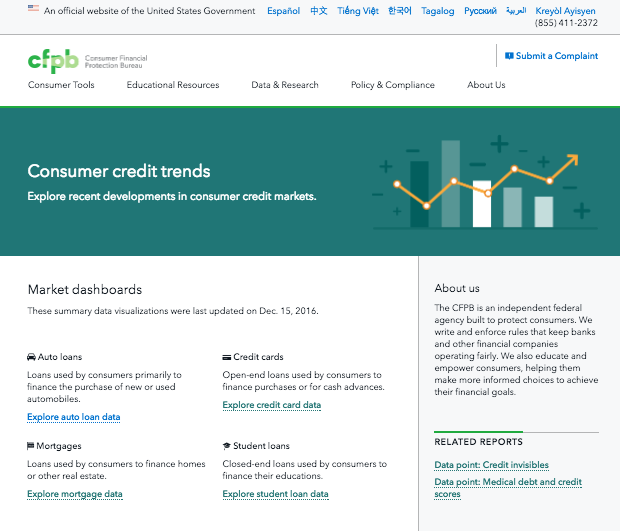

# Consumer credit trends
Explore recent developments in consumer credit markets.



## This project is a work in progress
Nothing presented in the issues or in this repo is a final product unless it is marked as such or appears on http://www.consumerfinance.gov/data-research/consumer-credit-trends/. Some copy or formulas may be replaced with dummy text to ensure that we follow any and all privacy and security procedures at the CFPB. All the designs, layouts, and evolution of our decision making process are accurate.

## We want your feedback, but will not be able to respond to everyone
We are working under an agile framework, and plan to use this repo to publish, receive feedback, and iterate on that feedback as often as possible. Our goal is to see user trends and reactions to our work. We want as much feedback as possible to help us make informed decisions so that we can make this tool better. Unfortunately, we will not be able to respond to every piece of feedback or comment we receive, but intend to respond with our progress through the evolution of the tool.

## Installation

This project requires that you have [Node.js](https://nodejs.org/en/) installed.

To run this website locally:

1. Clone repo
1. Create an `env.js` file and add your [Github personal access token](https://github.com/blog/1509-personal-api-tokens) there:

  ```bash
  cp src/static/js/env_SAMPLE.js src/static/js/env.js
  ```
1. In Terminal, run `./setup.sh` from the root directory. This will install the required Node modules for the project.
1. Run the following command:
  ```
  gulp watch
  ```
  This should open a new window in your browser with the `/dist/index.html` file visible at [`http://localhost:3000/`](http://localhost:3000/)

## Release workflow

When working on feature branches that are still in development, use the workflow described above in the [Installation](#installation) instructions.

For publishing the graphs to compiled HTML for use in a production environment, use the following Release workflow.

1. Check out and pull from the latest `gh-pages` branch from upstream.

  ```
  git checkout gh-pages
  git pull upstream gh-pages
  ```
1. Create a new branch and check it out locally:

  ```
  git checkout -b release-v2000
  ```
1. Merge your feature branch work into your release branch locally:

  ```
  git merge feature-branch-2000
  ```
1. Build the front end using the watch task:[*](#watch-note)

  ```
  gulp watch
  ```
1. In a new Terminal window, run the release task to generate your production-ready HTML:

  ```
  gulp release
  ```

1. Review your production HTML locally to check that it's ready to commit (no server required - just open the HTML file at `consumer-credit-trends/index.html` in your browser).
1. Commit your production ready files, `index.html` and the `charts` folder, to your release branch and push to Github:

  ```
  git add index.html
  git add charts
  git commit -m ''
  git push origin release-v2000
  ```
1. Submit your pull request to the `gh-pages` branch for review.
1. Optional: test your production pages in Github by merging your release branch to **your** fork of `gh-pages`. You can then post the link to your PR for others to easily review.

  ```
  git checkout gh-pages
  git merge release-v2000
  git push origin gh-pages
  ```
1. Once it's merged, visit https://cfpb.github.io/consumer-credit-trends/ to view the published HTML files.

<small><a name="watch-note"></a><strong>*</strong>Note that you must run the `watch` task so that the release task can access your localhost environment to grab the rendered svg code.</small>

## About the data

[Documentation about the data](data/README.md) is available and contains definitions for each column and field value in the csv files.

## Troubleshooting

Common errors and their causes:

#### Scenario: Running `gulp release` task
```bash
      window.setTimeout( getSVG, 10000 );
            ^

TypeError: Cannot read property 'setTimeout' of undefined
```
This error happens when you run `gulp release` without a local server running. Make sure you have the `gulp watch` task running in a separate Terminal window when you run `gulp release`. See [Release Workflow](#release-workflow) instructions for more details.

## Getting help

Use the [issue tracker](https://github.com/cfpb/consumer-credit-trends/issues) to follow the
development conversation.
If you find a bug not listed in the issue tracker,
please [file a bug report](https://github.com/cfpb/consumer-credit-trends/issues/new?body=
%23%23%20URL%0D%0D%0D%23%23%20Actual%20Behavior%0D%0D%0D%23%23%20Expected%20Behavior
%0D%0D%0D%23%23%20Steps%20to%20Reproduce%0D%0D%0D%23%23%20Screenshot&labels=bug).


## Getting involved

We welcome your feedback and contributions.
See the [contribution guidelines](CONTRIBUTING.md) for more details.

Additionally, you may want to consider
[contributing to the Chart Builder](https://github.com/cfpb/cfpb-chart-builder),
which is the chart generator and library used to create the d3 data visualizations in this project.


## Open source licensing info
1. [TERMS](TERMS.md)
2. [LICENSE](LICENSE)
3. [CFPB Source Code Policy](https://github.com/cfpb/source-code-policy/)


## Credits and references

This project uses:

- [Capital Framework](https://github.com/cfpb/capital-framework)
for its user interface and layout components.
- [CFPB Chart Builder](https://github.com/cfpb/cfpb-chart-builder)
for its data visualizations.
